<p align="center">
  
</p>

<p align="center">
  <a href="#"></a>
  <a href="#systems"></a>
  <a href="#ai-lab"></a>
  <a href="#stack"></a>
  <a href="#architecture"></a>
  <a href="#activity"></a>
  <a href="#roadmap"></a>
  <a href="#connect"></a>
</p>

<p align="center">
  
</p>

<p align="center">
  
</p>

> I build **integrated organisational platforms** — systems where membership, finance,
> programmes, commerce, documents and communications stop being separate spreadsheets
> and become one coherent application.
>
> Most of my work is private, so everything here is described by **system type,
> architecture and capability** rather than by owner.

---

## Status

<p align="center">
  
</p>

<p align="center">
  
</p>

| Subsystem | State | What it means in practice |
|---|:--:|---|
| **Laravel core** | 🟢 `ACTIVE` | Modular monolith, domain-separated modules, service + repository boundaries |
| **AI agents** | 🟢 `ACTIVE` | Orchestrated agents with shared skills, standards and MCP integrations |
| **Automation** | 🟢 `ACTIVE` | Queues, scheduled jobs, document pipelines, CI workflows |
| **PWA delivery** | 🟢 `ACTIVE` | Installable, offline-aware member-facing interfaces |
| **Data / reporting** | 🟢 `ACTIVE` | Schema design, reporting queries, exports |
| **Security / ISMS** | 🟡 `EXPLORING` | Control mapping, audit evidence, risk registers |

<sub>The focus panel above is generated from <a href="data/profile.json">data/profile.json</a> by a GitHub Action — edit the JSON, the widget follows.</sub>

---

## Systems

<p align="center">
  
</p>

<sub>🔒 Every system below is a real build described generically. Organisation, client, domain and repository identities are deliberately withheld.</sub>

<details>
<summary><b>▸ Organisation Management System</b> — <i>integrated enterprise web platform</i></summary>

<br>

An integrated digital ecosystem covering the operational, administrative, financial,
membership, programme and public-facing functions of an organisation.

| | |
|---|---|
| **Type** | Integrated enterprise web platform |
| **Interfaces** | Public Website · Member Portal · PWA · Admin Console |
| **Architecture** | Modular monolith · Role-based · API-ready · Event-driven jobs |
| **Scale** | 14 functional modules across 4 interfaces |

**Capabilities**


**Problem** — membership, finance, programmes and documentation run as disconnected
processes: parallel spreadsheets, manual receipts, chat-based approvals, no single
source of truth for who a member is or what they owe.

**Solution** — one identity model and one ledger behind four interfaces, so a member
record, a payment and a programme registration are the same data seen from different
angles.

**Engineering focus** — modular architecture · database design · business process
automation · role-based access · payment integration · PWA · background processing ·
auditability · responsive UI.

**Representative data** *(invented sample values — never production data)*

```text
User Name:   Alex Morgan
Member ID:   MEM-2026-001
Programme:   Leadership Workshop
Fund:        Community Fund
Amount:      RM 100.00
```

</details>

<details>
<summary><b>▸ Commerce + Operations Platform</b> — <i>storefront, POS and inventory on one ledger</i></summary>

<br>

| | |
|---|---|
| **Type** | Commerce and operations platform |
| **Interfaces** | Storefront · POS Terminal · Back Office |
| **Architecture** | Shared catalogue · Stock ledger · Gateway abstraction · Idempotent callbacks |

**Capabilities** — catalogue and variants · cart and checkout · order lifecycle and
fulfilment · stock movement and reconciliation · invoicing and quotations · payment
gateway integration · receipts and shift handling.

**Engineering focus** — the hard part is not the storefront, it is keeping one stock
figure honest while a POS terminal, a web order and a manual adjustment all move it.
Movements are recorded as an append-only ledger; gateway callbacks are idempotent so a
retried webhook cannot double-credit an order.

</details>

<details>
<summary><b>▸ AI Development Framework</b> — <i>agent orchestration workspace</i></summary>

<br>

| | |
|---|---|
| **Type** | AI engineering workspace |
| **Interfaces** | CLI · Editor integration · Automation hooks |
| **Architecture** | Orchestrator · Specialised agents · Shared context · Skill and plugin registry |

**Capabilities** — agent orchestration · reusable skills and plugins · MCP integrations ·
project profiles · development standards · automated workflows · knowledge management.

**Engineering focus** — making AI assistance *repeatable* rather than improvised per
prompt: standards live in the framework, not in whoever happens to be typing.
See [AI Lab](#ai-lab) for the pipeline.

</details>

<details>
<summary><b>▸ Event Management Platform</b> — <i>multi-type events, registration and check-in</i></summary>

<br>

| | |
|---|---|
| **Type** | Event and registration system |
| **Interfaces** | Public listing · Registration flow · PWA check-in · Organiser console |
| **Architecture** | Configurable event types · Capacity rules · Stateful registration · Notification pipeline |

**Capabilities** — multi-type event configuration · registration and ticketing flows ·
capacity and waitlist handling · attendance capture · notifications and reminders ·
post-event reporting.

**Engineering focus** — one registration engine that adapts to event types rather than a
new codebase per event; check-in works from a phone on unreliable venue connectivity.

</details>

<details>
<summary><b>▸ Governance + Security Toolkit</b> — <i>ISMS documentation, controls and audit evidence</i></summary>

<br>

| | |
|---|---|
| **Type** | Governance and compliance tooling |
| **Interfaces** | Documentation set · Register views · Audit exports |
| **Architecture** | Control mapping · Risk register · Evidence trail · Review cycles |

**Capabilities** — ISMS documentation framework · control mapping · risk register and
treatment · audit evidence tracking · IT audit checklists · policy review cycles.

**Engineering focus** — turning compliance from a document graveyard into a queryable
structure: controls map to evidence, evidence maps to review dates.

</details>

<details>
<summary><b>▸ Membership + User Portal</b> — <i>one identity across web, portal and app</i></summary>

<br>

| | |
|---|---|
| **Type** | Identity and self-service surface |
| **Interfaces** | Member Portal · PWA · Admin Console |
| **Architecture** | Single identity model · Role and permission matrix · Session and device handling |

**Capabilities** — registration and verification · profile self-service · roles and
permissions · statements and history · notifications · audit logging.

**Engineering focus** — one account model shared across three interfaces, so permissions
are defined once and enforced everywhere rather than re-implemented per surface.

</details>

### Workspace

```text
📁 enterprise-systems/          📁 commerce/
├── Organisation Management     ├── E-Commerce Platform
├── Academic Administration     ├── POS System
├── Membership + User Portal    ├── Inventory Management
└── Administrative Workflow     ├── Invoice + Quotation
                                └── Payment Integration

📁 events/                      📁 ai-engineering/
├── Event Management Platform   ├── AI Development Framework
├── Registration Management     ├── Agent Orchestration
└── PWA Event Experience        ├── Shared Agent Skills
                                └── Development Automation

📁 governance/
├── ISMS Documentation Framework
├── IT Audit Toolkit
├── Risk Management
└── Security Governance
```

---

## Architecture

How a multi-interface organisational platform hangs together.

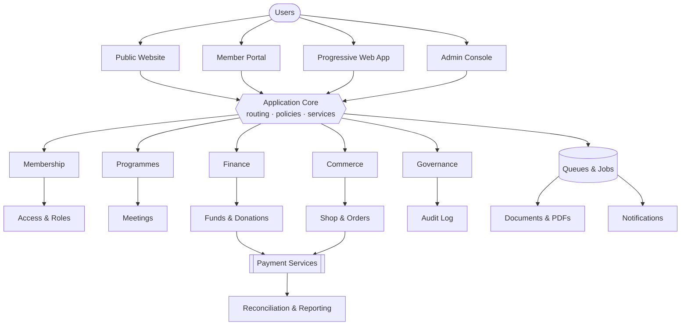

<details>
<summary><b>▸ Request lifecycle</b> — how one action moves through the system</summary>

<br>

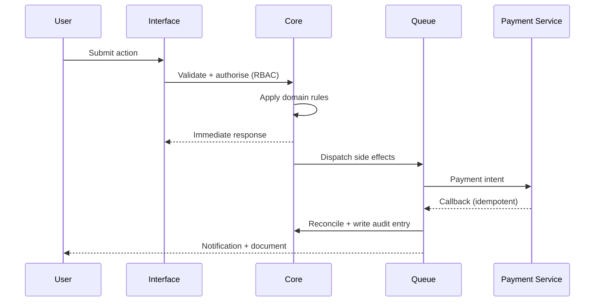

The interface never waits on a gateway, a PDF or an email. Everything slow is queued;
everything that changes money or membership writes an audit entry.

</details>

<details>
<summary><b>▸ Design principles</b></summary>

<br>

| Principle | Applied as |
|---|---|
| **One identity** | A member is one record, seen differently by four interfaces |
| **Modular boundaries** | Domain modules with explicit service interfaces, not a shared soup of models |
| **Everything slow is queued** | Payments, documents, notifications and exports run as jobs |
| **Auditable by default** | State changes to money, membership and access are logged, not inferred |
| **Permission once, enforced everywhere** | RBAC evaluated in the core, never re-implemented per surface |
| **Offline-tolerant edges** | PWA surfaces assume the venue Wi-Fi will fail |

</details>

---

## AI Lab

<p align="center">
  
</p>

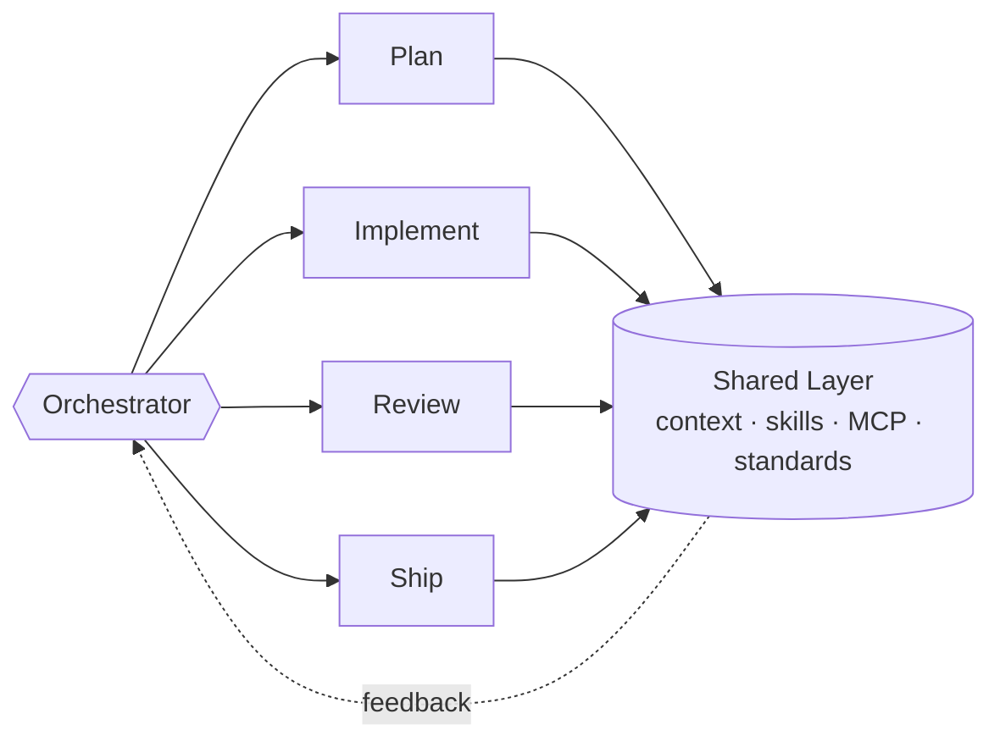

| Layer | Responsibility |
|---|---|
| **Orchestrator** | Intent routing, standards enforcement, task decomposition |
| **Specialised agents** | Plan · implement · review · ship, each with a narrow remit |
| **Skills & plugins** | Reusable procedures instead of re-explaining the same workflow |
| **MCP integrations** | Tool access to real project surfaces |
| **Shared context** | Project profiles and engineering standards every agent inherits |
| **Knowledge management** | Decisions captured where the next session will find them |

<sub>Architecture shown conceptually — no private repositories or client workloads referenced.</sub>

---

## Stack

<p align="center">
  
</p>

**Backend**


**Frontend**


**Database**


**AI Engineering**


**Infrastructure**


**Governance / Security**


<sub>Stack groups are defined in <a href="data/stack.json">data/stack.json</a>.</sub>

---

## Activity

<p align="center">
  
</p>

<p align="center">
  
</p>

<p align="center">
  
  
</p>

<sub>The focus split above is self-declared, not live telemetry. The panels below it read public GitHub data only — private repositories are never enumerated.</sub>

---

## Roadmap

<details open>
<summary><b>▸ Now building</b></summary>

<br>

- [x] Multi-interface organisational platform architecture
- [x] Payment gateway abstraction with idempotent callbacks
- [x] Reusable agent framework with shared skills and standards
- [ ] Deeper reporting and export layer across modules
- [ ] Formalised ISMS control-to-evidence mapping

</details>

<details>
<summary><b>▸ Next</b></summary>

<br>

- [ ] API-first extraction of core domain modules
- [ ] Automated regression coverage on money and membership paths
- [ ] Agent-assisted code review integrated into CI
- [ ] Offline-first improvements for field / venue use

</details>

---

## Connect

<p align="center">
  <a href="https://github.com/Afyz97"></a>
  
</p>

<p align="center">
  <sub>Add further contact badges in <a href="docs/CUSTOMIZATION.md">docs/CUSTOMIZATION.md</a> — kept minimal here by design.</sub>
</p>

<p align="center">
  
</p>

<p align="center">
  <sub>
    Private systems are described generically by architecture and capability. No client, organisation,
    institution, production domain or operational data is disclosed —
    see <a href="docs/PRIVACY-REVIEW.md">the privacy review</a>.
  </sub>
</p>
